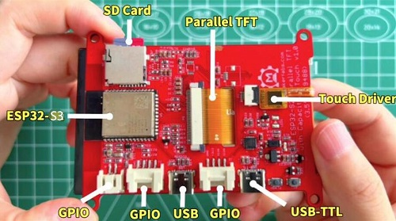

# Makerfabs ESP32-S3 Parallel TFT with Touch

```c++
/*
Version:		V1.0
Author:			Vincent
Create Date:	2022/5/24
Note:
	
*/
```


[toc]

# Makerfabs

[Makerfabs home page](https://www.makerfabs.com/)

[Makerfabs Wiki](https://makerfabs.com/wiki/index.php?title=Main_Page)

# Makerfabs ESP32-S3 Parallel TFT with Touch
## Introduction

[Product Link](https://www.makerfabs.com/esp32-s3-parallel-tft-with-touch-ili9488.html)

[Wiki Link](https://www.makerfabs.com/wiki/index.php)

The 3.5" 320x480 TFT LCD driver is an ILI9488. It uses a 16-bit parallel line for communication with ESP32-S3. The main clock can be set up to 20 MHz, making the display smooth enough for videos. You can freely use some of the Mabee pins (I2c and IOs) with the breakout connectors, to connect the ESP32-S3 display with sensors / actuators, suitable for IoT applications.



## Feature

- Wi-Fi (2.4 GHz band)
- Bluetooth Low Energy
- Dual high performance Xtensa® 32-bit LX7 CPU cores
- Ultra Low Power co-processor running either RISC-V or FSM core
- Multiple peripherals
- Built-in security hardware
- USB OTG interface
- USB Serial/JTAG Controller
- Arduino Compatible: You can use it with Arduino IDE
- LCD 3.5 inch Amorphous-TFT-LCD (Thin Film Transistor Liquid Crystal Display) for mobile-phone or handy electrical equipment
- LCD Driver: ILI9488 (16-bit parallel line)
- LCD Resolution: 320*480
- FT6236 Series ICs are single-chip capacitive touch panel controller IC with a built-in 16-bit enhanced micro-controller unit (MCU).
- NS2009: A 4-wire resistive touch-screen control circuit with I2C interface, which contains a 12-bit resolution A/D converter
- Power supply: 5V, Type-C USB
- Micro SD card slot on the board
- Dual USB Type-C: one for native USB and one for USB-to-UART
- Two Mabee interfaces
- Board size: 66mm * 85mm

# Code

## Compiler Options

- Install board: ESP32
- Install library: [LovyanGFX library](https://github.com/lovyan03/LovyanGFX). 
- Edit the code based on the touch screen. If you use a resistive screen (which is the case here), choose NS2009_TOUCH. If you use a capacitive screen, choose FT6236_TOUCH.
- Use a type-C use cable to connect USB-TTL to PC.
- To compile and upload code, select "ESP32-S3 DEV Module" and "UART0".


## Firmware

### SD16_3.5

Factory firmware. First it runs the boot self-test to check the hardware. Press down in the middle of the touch screen as prompted to display a picture on the SD card, MakerFabs' logo. Finally, it prints the touch coordinates on the serial port.
